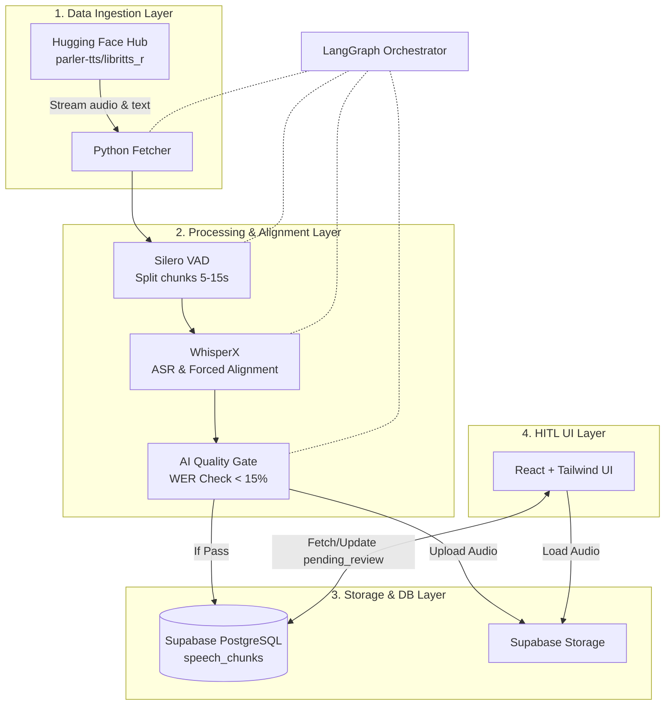

# System Architecture: Agentic Speech Dataset Engineering Pipeline

## 0. High-Level Diagram

## 1. Tech Stack Overview
- **Orchestration:** LangGraph (Python)
- **Audio Processing:** Hugging Face `datasets`, `silero-vad`, `whisperx` (`faster-whisper`), `jiwer`
- **Database & Storage:** Supabase (PostgreSQL, Storage) - Free Tier
- **Frontend / HITL UI:** React (Vite), TailwindCSS, `wavesurfer.js` (v7+)
- **Hosting:** Vercel (Frontend), Supabase Cloud (Backend)

---

## 2. Data Ingestion Layer (Python)
- **Source:** Hugging Face Hub `parler-tts/libritts_r`.
- **Strategy:** `streaming=True`. Iterative fetch (audio arrays + ref text) to RAM. 0 native disk download. Saves bandwidth/storage.

---

## 3. Processing & Alignment Layer (Python)
- **VAD (Voice Activity Detection):** `silero-vad`. Strip silence. Split stream -> 5-15s chunks.
- **ASR & Alignment:** `whisperx` (`faster-whisper` backend).
  - Transcribe chunks.
  - Run phoneme alignment -> exact word-level ms timestamps (start/end).
- **AI Quality Gate (AI-as-a-Judge):** `jiwer` library.
  - Calculate WER (Word Error Rate) vs original LibriTTS-R text.
  - **Rule:** `if WER > 15% -> discard chunk`. Skips bad data, saves human time.

---

## 4. Orchestration & Storage Layer
- **Workflow Orchestrator:** `langgraph`. Stateful compiled graph.
  - **Nodes Flow:** `fetch_hf_stream` -> `process_vad` -> `align_whisperx` -> `evaluate_wer` -> `insert_db`.
- **Database & Object Storage:** Supabase (PostgreSQL + S3-compatible storage).
- **Interaction:** `supabase-py`. Upload audio chunk to Storage, save metadata to DB.
- **Table `speech_chunks`:**
  - `id`: UUID, `dataset_id`: String, `audio_url`: String
  - `original_text`: Text, `aligned_text_with_timestamps`: JSONB
  - `wer_score`: Float, `status`: Enum (`pending_review`, `approved`, `rejected`)

---

## 5. HITL Validation UI (React + TailwindCSS)
- **Framework:** React (via Vite) + TailwindCSS. Light, fast, and Vercel-ready.
- **Client:** `@supabase/supabase-js`.
- **Audio UI:** `wavesurfer.js` v7+ with `Regions` plugin.
- **Review Workflow:**
  1. **Fetch:** Load 1 row where `status = 'pending_review'`.
  2. **Render:** Draw waveform + bounding boxes (from JSONB timestamps).
  3. **Edit (Mouse):** Drag region edges to fix timestamps. Edit region text.
  4. **Rapid Control (Keyboard):**
     - `Space`: Play / Pause.
     - `Enter`: Save edits, update `status = 'approved'` -> load next.
     - `Delete`: Update `status = 'rejected'` -> load next.
