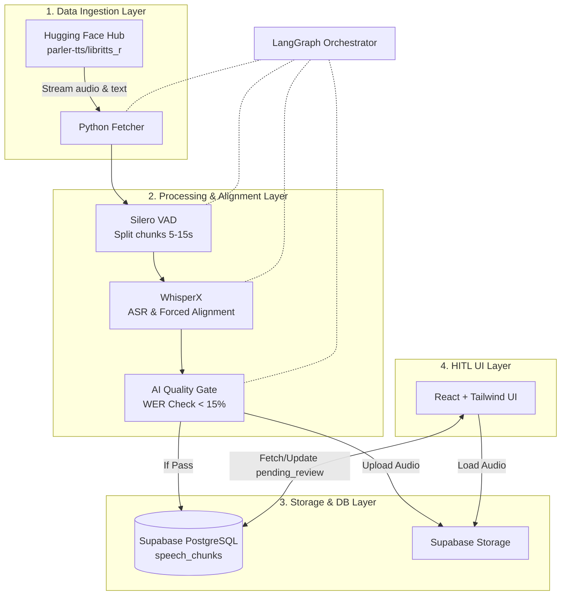

# System Architecture: Agentic Speech Dataset Engineering Pipeline

## 0. High-Level Diagram

## 1. Tech Stack Overview
- **Orchestration:** LangGraph (Python)
- **Audio Processing:** Hugging Face `datasets`, `silero-vad`, `whisperx` (`faster-whisper`), `jiwer`
- **Database & Storage:** Supabase (PostgreSQL, Storage) - Free Tier
- **Frontend / HITL UI:** React (Vite), TailwindCSS, `wavesurfer.js` (v7+)
- **Hosting:** Vercel (Frontend), Supabase Cloud (Backend)
- **Testing (TDD):** `pytest` (Backend), `vitest` + `testing-library/react` (Frontend)

---

## 2. Data Ingestion Layer (Python)
- **Source:** Hugging Face Hub `parler-tts/libritts_r`.
- **Strategy:** `streaming=True`. Iterative fetch (audio arrays + ref text) to RAM. 0 native disk download. Saves bandwidth/storage.

---

## 3. Processing & Alignment Layer (Python)
- **VAD (Voice Activity Detection):** `silero-vad`. Strip silence. Split stream -> 5-15s chunks.
- **ASR & Alignment:** `whisperx` (`faster-whisper` backend).
  - Transcribe chunks.
  - Run phoneme alignment -> exact word-level timestamps in seconds (start/end floats).
- **AI Quality Gate (AI-as-a-Judge):** `jiwer` library.
  - Calculate WER (Word Error Rate) vs original LibriTTS-R text.
  - **Rule:** `if WER > 15% -> discard chunk`. Skips bad data, saves human time.

---

## 4. Orchestration & Storage Layer
- **Workflow Orchestrator:** `langgraph`. Stateful compiled graph.
  - **Nodes Flow:** `fetch_hf_stream` -> `process_vad` -> `align_whisperx` -> `evaluate_wer` -> `insert_db`.
  - **Error Handling:** LangGraph graph includes an `on_error` edge. If any node (VAD, WhisperX, upload) throws, the chunk is logged with the error reason and skipped — the pipeline continues to the next item in the stream. Discarded chunks (WER > 15%) are silently dropped (not stored) since the source dataset is always re-streamable.
  - **Concurrency:** Pipeline processes chunks sequentially by default (GPU-bound). Batch size and parallelism can be tuned via environment variables (`BATCH_SIZE`, `MAX_WORKERS`) based on available GPU memory and Supabase free-tier API rate limits (~500 req/min).
- **Database & Object Storage:** Supabase (PostgreSQL + S3-compatible storage).
- **Interaction:** `supabase-py`. Upload audio chunk to Storage, save metadata to DB.
- **Table `speech_chunks`:**
  - `id`: UUID, `dataset_id`: String, `speaker_id`: String (nullable), `audio_url`: String
  - `original_text`: Text, `aligned_text_with_timestamps`: JSONB
  - `wer_score`: Float, `duration`: Float, `status`: Enum (`pending_review`, `approved`, `rejected`)
  - See `database_schema.md` for full schema, indexes, RLS policies, and triggers.

---

## 5. HITL Validation UI (React + TailwindCSS)
- **Framework:** React (via Vite) + TailwindCSS. Light, fast, and Vercel-ready.
- **Client:** `@supabase/supabase-js`.
- **Audio UI:** `wavesurfer.js` v7+ with `Regions` plugin.
- **Review Workflow:**
  1. **Fetch:** Load 1 row where `status = 'pending_review'`.
  2. **Render:** Draw waveform + bounding boxes (from JSONB timestamps).
  3. **Edit (Mouse):** Drag region edges to fix timestamps. Edit region text.
  4. **Rapid Control (Keyboard):**
     - `Space`: Play / Pause.
     - `Enter`: Save edits, update `status = 'approved'` -> load next.
     - `Delete`: Update `status = 'rejected'` -> load next.

---

## 6. Deployment & Development Model
- **Pattern: Decoupled Monorepo.** The frontend and backend are completely decoupled services that only interact via Supabase (Database/Storage). This is not a classic Monolith, but closer to a lightweight Microservices event-driven model.
- **Docker Packaging:** 
  - **Backend (Python):** Highly recommended and necessary. Python AI environments (PyTorch, WhisperX, CUDA, FFmpeg) are incredibly complex to standardize across OSes. Docker ensures the ML environment is strictly isolated and reproducible.
  - **Frontend (React/Vite):** Optional for development (`npm run dev` is sufficient), but recommended using standard Dockerfiles for production parity. 
- **Tooling:** Use `docker-compose.yml` at the root directory to spin up the entire pipeline seamlessly.

---

## 7. Testing Strategy (TDD)
- **TDD Requirement:** All core logic must be written with tests *before* or *alongside* implementation to ensure high reliability.
- **Backend (Python - `pytest`):**
  - **Unit Tests:** Mock Hugging Face dataset fetching. Test Silero VAD chunking logic on dummy tensors. Test WER calculation logic (`jiwer`).
  - **Integration Tests:** Test LangGraph node transitions (State Machine). Use local file fixtures to mock audio processing outputs before inserting into a test Supabase Project.
- **Frontend (React - `vitest` + `@testing-library/react`):**
  - **Unit Tests:** Test Audio Player component rendering. Mock `supabase-js` to ensure the correct `approved` or `rejected` API payload is fired on Keyboard interactions (Space, Enter, Delete).
